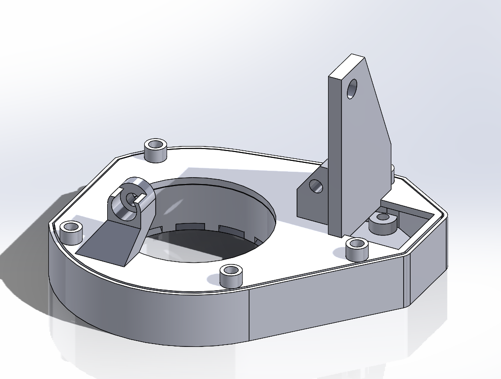
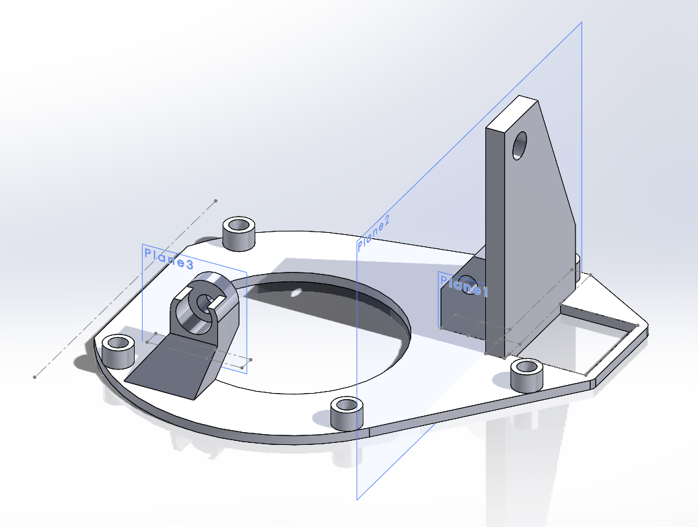
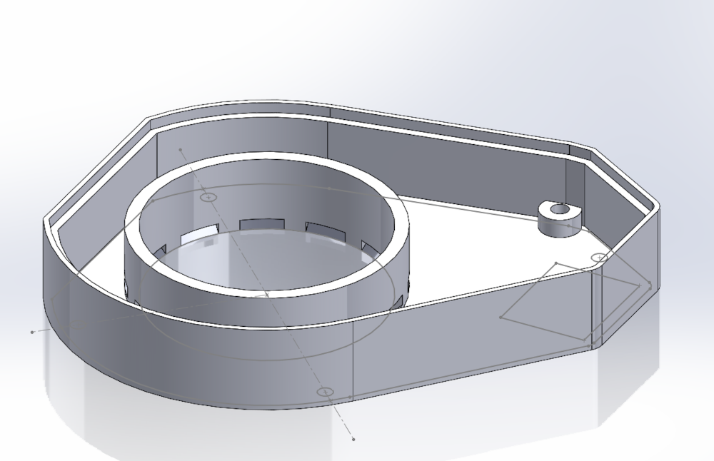
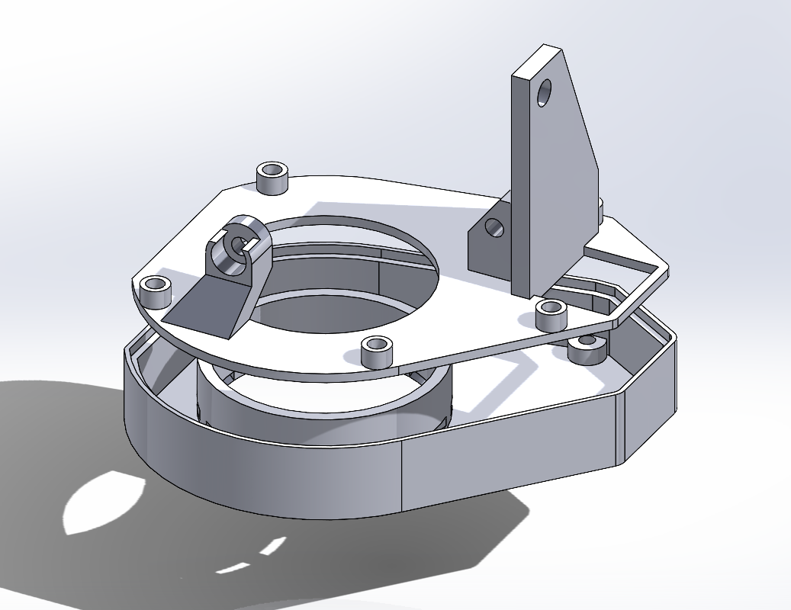
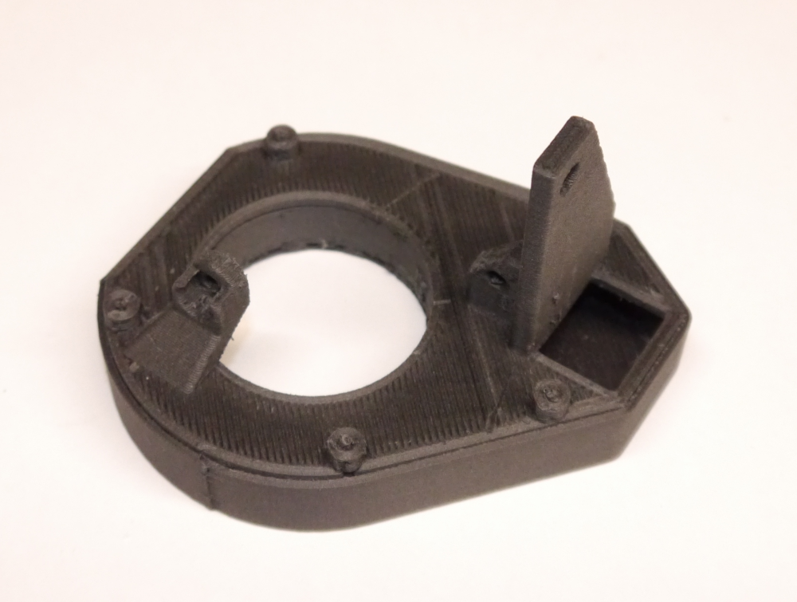
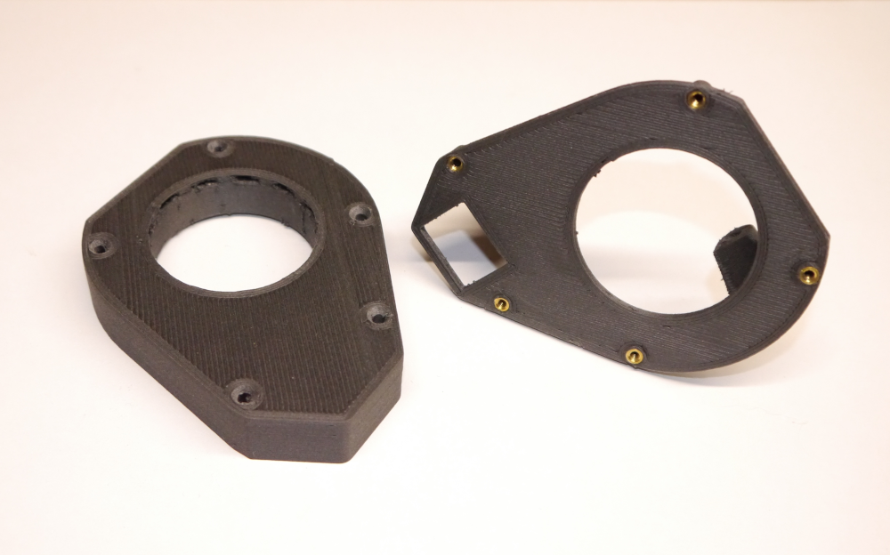

# Redesigned Fan Shroud for LulzBot Taz 3D Printer

A redesigned fan shroud for the LulzBot HE tool head found on my Taz Workhorse 3D printer.

Probably (?) fits other tool heads too, but is not compatible with the other tool head I own, the HS+.

I modified the existing design to allow the heater block to turn the entire 360 degrees without interference from the fan shroud. 
I've been using this part for more than two years without problem.

I used the original STL files from LulzBot to read off the exact locations of mating planes and mounting points; otherwise the design is original.

This repository contains both the Solidworks models and STL files for the parts.

## Description

A rather rough-looking example printed in nylon-CF. I used ABS for the final print.

## Disclaimer
You access to and use the contents of this site at your own risk.\
The author assumes no responsibility or liability for any errors or omissions in the content of this site.\
The information and models provided on this site are provided in good faith, however we make no representation  or warranty of any kind,
express or implied, regarding the accuracy, adequacy,  validity, reliability, or completeness of any information on the site.

## Contact
ac8p@proton.me

